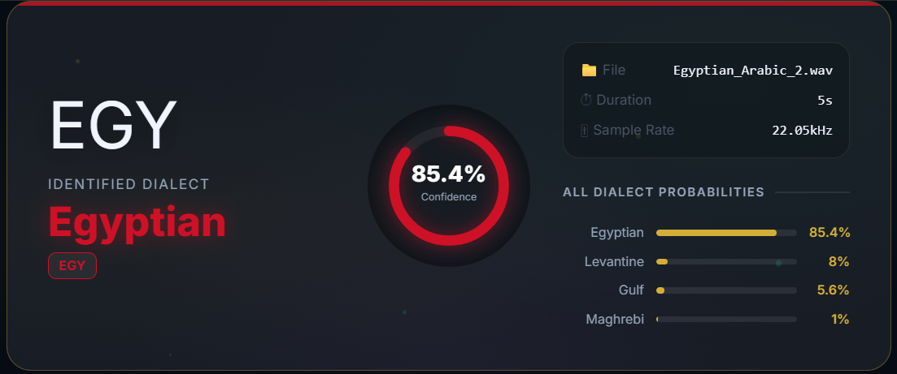
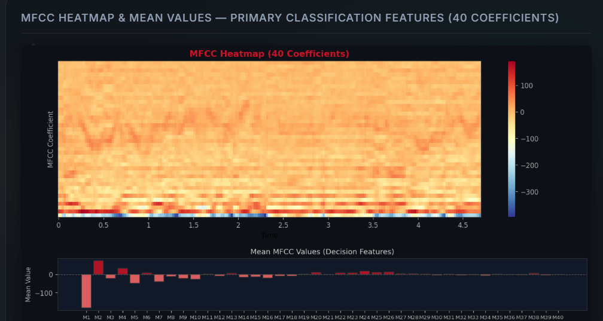
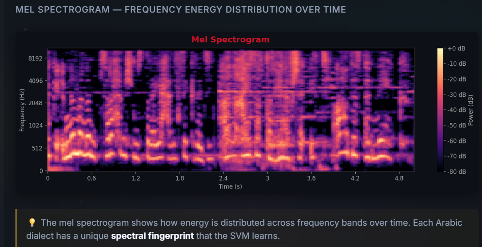
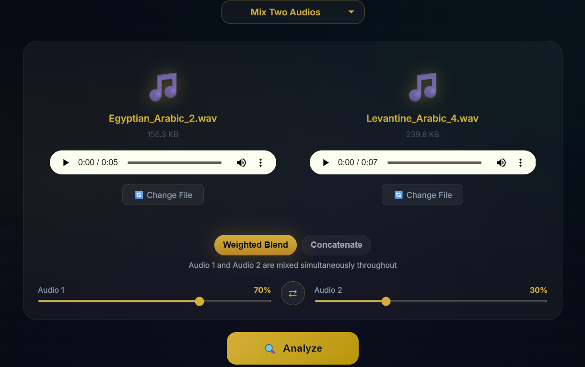
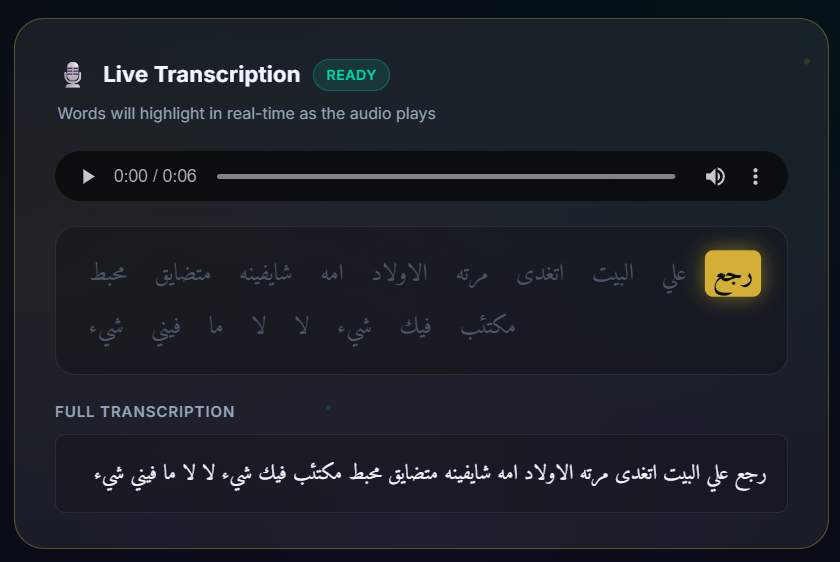
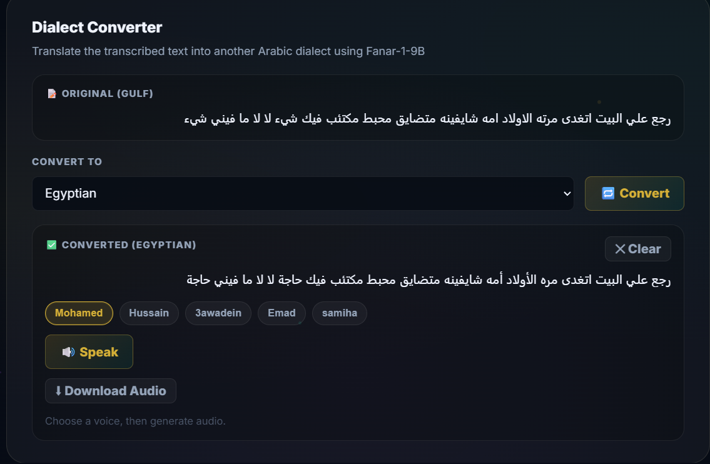

# Lahgtna — Arabic Dialect Identifier

An end-to-end Arabic dialect analysis platform — identify, transcribe, convert, and synthesize speech across Egyptian, Gulf, Levantine, and Maghrebi dialects.

   

## Features
- 🎙 Single-file dialect classification across 4 Arabic dialects with confidence scores
- 🔀 Mixed-audio analysis: blend two audio files by weight (weighted average or concatenation splice)
- 📊 8 acoustic feature visualizations per analysis (waveform, mel spectrogram, MFCC heatmap, chroma, spectral contrast, ZCR, RMS, feature overview)
- 📝 Real-time transcription with word-level highlight sync (Deepgram Nova-3)
- 🔄 Dialect-to-dialect text conversion (Egyptian ↔ Gulf ↔ Levantine ↔ Maghrebi)
- 🔊 Text-to-speech with 5 selectable voices, play/pause control, and audio download

## Screenshots

*Upload a single audio clip, trigger analysis, and view the predicted dialect with confidence and core stats.*

<table>
    <tr>
        <td></td>
        <td></td>
    </tr>
</table>
*Side-by-side acoustic diagnostics: MFCC heatmap for timbral texture and mel spectrogram for frequency-energy patterns.*


*Blend two recordings with a weight slider or splice mode, then analyze the hybrid signal for dialect cues.*


*Deepgram Nova-3 transcript with word-level timing so the highlight follows playback.*


*Convert dialect text via Groq llama-3.3-70b and synthesize with ElevenLabs voices, with playback controls.*

## Architecture
Audio flows through librosa decoding at 22050 Hz, then 222 features are extracted: 40 MFCCs mean + 40 MFCCs std, 40 delta MFCCs, 40 delta-delta MFCCs, 12 chroma, 7 spectral contrast, 40 mel, and 3 scalar features. Features are normalized with StandardScaler and passed into a custom-trained scikit-learn classifier to yield dialect confidence and probabilities. In parallel, raw audio is sent to Deepgram Nova-3 to produce the transcript and word-level timestamps. The transcript is converted by Groq llama-3.3-70b into the target dialect, then synthesized to MP3 with ElevenLabs TTS. The frontend consumes both analysis and transcription streams to render dashboards, charts, and playback controls.

```
project-root/
├── backend/
│   ├── backend/          # Django settings, urls, wsgi
│   ├── dialect_api/      # All views + URL routes
│   │   ├── views.py      # All 7 API endpoints
│   │   └── urls.py
│   ├── dialect_model.pkl # Trained scikit-learn classifier
│   ├── scaler.pkl        # StandardScaler (fitted on training set)
│   └── requirements.txt
└── frontend/
    └── src/app/
        ├── components/
        │   ├── upload/         # File upload + mix mode
        │   ├── result-dashboard/ # Charts, conversion, TTS
        │   └── transcription/  # Word-highlight player
        ├── services/
        │   └── dialect.service.ts
        └── models/
            └── analysis-result.interface.ts
```

## API endpoints
| Method | Endpoint | Input | Output |
| --- | --- | --- | --- |
| POST | /api/analyze/ | audio file (multipart) | dialect prediction + 8 base64 plots |
| POST | /api/analyze-mix/ | audio1, audio2, weight, mix_method (multipart) | same as above |
| POST | /api/transcribe/ | audio file (multipart) | { full_text, words: [{word, start, end}] } |
| POST | /api/convert-dialect/ | { text, source_dialect, target_dialect } | { converted_text } |
| GET | /api/voices/ | — | [{ id, name, description }] (5 ElevenLabs voices) |
| POST | /api/tts/ | { text, voice_id } | MP3 audio stream |
| GET | /api/health/ | — | { status, model_loaded, scaler_loaded } |

## Setup & Installation
### Backend
```bash
cd backend
python -m venv venv
venv\Scripts\activate        # Windows
# source venv/bin/activate   # Mac/Linux
pip install -r requirements.txt
```

Create a `backend/.env` file with:
```
DEEPGRAM_API_KEY=your_key_here
GROQ_API_KEY=your_key_here
ELEVENLABS_API_KEY=your_key_here
```

Then:
```bash
python manage.py migrate
python manage.py runserver
```

### Frontend
```bash
cd frontend
npm install
ng serve
```

App runs at http://localhost:4200, backend expected at http://localhost:8000.

## The 222 features
| Feature Group | Count | What it captures |
| --- | --- | --- |
| MFCCs (mean) | 40 | Average vocal tract shape across the clip |
| MFCCs (std) | 40 | Variability of vocal tract shape |
| Delta MFCCs | 40 | Rate of change of vocal tract shape (speech dynamics) |
| Delta-Delta MFCCs | 40 | Acceleration of vocal tract changes |
| Mel Spectrogram | 40 | Raw frequency-energy distribution |
| Chroma | 12 | Tonal/pitch-class fingerprint |
| Spectral Contrast | 7 | Harmonic vs noise ratio per frequency band |
| Spectral Rolloff | 1 | Spectral brightness (high = fricative-rich) |
| ZCR | 1 | Zero crossing rate (consonant density) |
| RMS Energy | 1 | Overall loudness / speaking intensity |
| **Total** | **222** | |

## Dialect coverage
| Dialect | Region | Key acoustic traits |
| --- | --- | --- |
| Egyptian | Egypt | Hard "g" sound, vowel-rich, lower ZCR, warm spectral rolloff |
| Gulf | Arabian Peninsula | Uvular/pharyngeal sounds, moderate energy, low spectral rolloff |
| Levantine | Syria, Lebanon, Jordan, Palestine | Musical intonation, balanced contrast, lower MFCC variance |
| Maghrebi | Morocco, Algeria, Tunisia, Libya | Consonant clusters, high ZCR, high spectral rolloff, rapid speech |

## Acknowledgements
- Deepgram Nova-3 for Arabic STT
- Groq for fast LLM inference (llama-3.3-70b-versatile)
- ElevenLabs for multilingual TTS
- librosa for audio feature extraction
